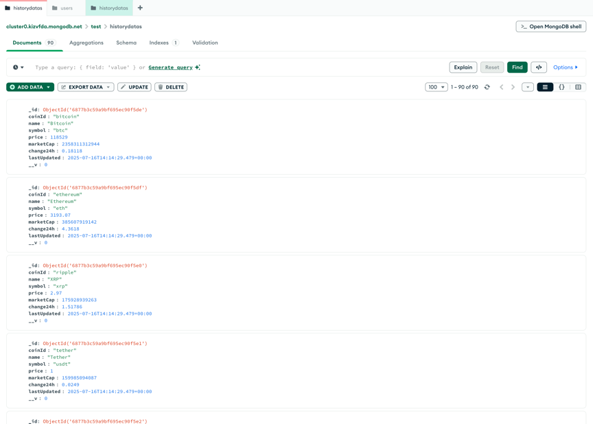
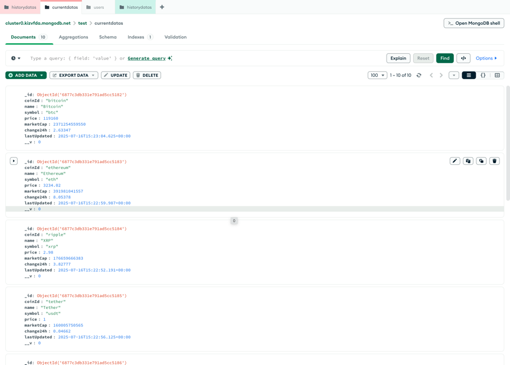
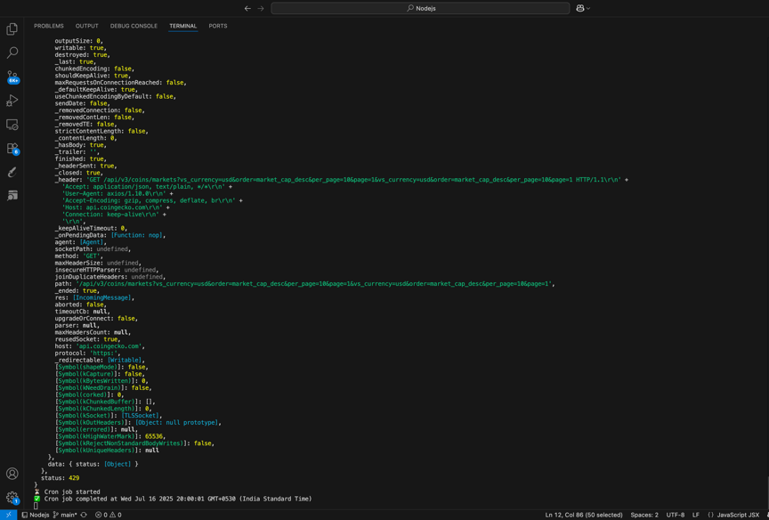

README — Crypto Tracker
 Project Overview
A Full Stack Cryptocurrency Tracker built with the MERN stack. It fetches real-time data from CoinGecko and provides users with an auto-refreshing dashboard, historical tracking, and live deployment.
Tech Stack Used

Frontend: React
Backend: Node.js, Express
Database: MongoDB
Scheduler: node-cron
API Source: CoinGecko API (https://www.coingecko.com/en/api/documentation)
Deployment:
- Frontend: Vercel
- Backend: Render 
- Database: MongoDB Atlas 

 Setup Instructions
1. Clone the Repository

git clone https://github.com/Bhaskar-1209/crypto-tracker.git
cd crypto-tracker

2. Install Dependencies

# Install client
cd client
npm install

# Install server
cd ../server
npm install

3. Create .env File

# server/.env
PORT=7070
MONGO_URI=your_mongodb_connection_string

4. Run the App Locally

# Run backend
cd server
npm run dev

# Run frontend
cd ../client
npm start

Cron Job Setup

A cron job is configured using node-cron that:
- Runs every 1 hour
- Fetches data from CoinGecko
- Saves it to the HistoryData collection/table

You can find it in:
/cron/fetchCoins.js

It is triggered automatically when the server starts.

Live Links

Frontend: https://crypto-tracker-uojo.vercel.app/
Backend API: https://crypto-tracker-ccq7.onrender.com/api/coin

 Project Structure

crypto-tracker/
├── client/crypto/         
│   ├── node_modules/
│   ├── public/                  
│   ├── src/                     
│   │   ├── assets/
│   │   ├── Components/        
│   │   │   └── coinChart.jsx    
│   │   ├── App.jsx             
│   │   ├── App.css              
│   │   ├── index.css          
│   │   └── main.jsx             
│   ├── index.html               
│   ├── package.json            
│   ├── package-lock.json        
│   ├── vite.config.js 
│   ├── eslint.config.js        

├── server/                 
│   ├── controllers/           
│   │   └── coinController.js
│   ├── cron/
│   │   └── fetchCoins.js
│   ├── models/               
│   │   ├── CurrentData.js
│   │   └── HistoryData.js
│   ├── routes/                 
│   │   └── coinRoutes.js
│   └── server.js     
        ├── .env                                   
├── package.json
├── package-lock.json  
└── README.md  
🔹 Sample Data in Database
 
 
 
🔹 Cron Job Execution
 

API Endpoints
Method	Endpoint	Description
GET	/api/coins	Returns Top 10 cryptocurrencies
POST	/api/history	Saves snapshot to the database
GET	/history/:coinId
    Returns historical data 
Final Notes

This project demonstrates:
- Real-time API integration
- Database modeling
- Scheduled automation
